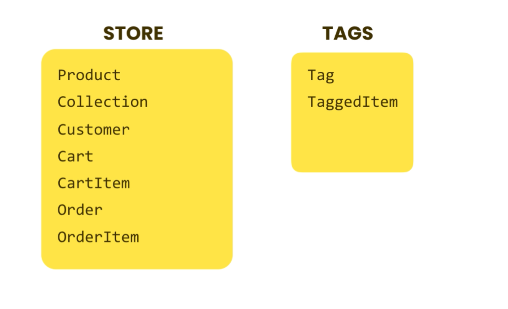

## Storefront Django App requirements and installation:
### Create Application
1. Install vscode
2. `mkdir storefront`
3. `pipenv install django`
4. `pipenv shell`
5. `django-admin startproject storefront .`
6. `python3 manage.py runserver`
7. add venv to vscode > command palette > select interpreter > (add location) using cmd: `pipenv —venv`
8. `python3 manage.py startapp playground`
9. Add `urls.py` in `playground` and link to the `storefront` `urls.py` for mapping the views
10. Debug django: `pipenv install django-debug-toolbar`
11. Create 2 app for e-commerce website 
 

12. Create models and relationships

### Create database (make migrations)
1. `python manage.py makemigrations`

